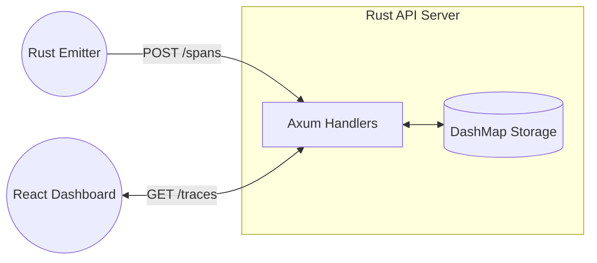

# Traced: High-Performance Distributed Trace Collector

**Traced** is a production-grade, distributed span ingestion and visualization system built entirely in **Rust** and **React**. It simulates the backend of an observability platform like Datadog or Honeycomb, capable of assembling disparate spans into coherent traces, managing data lifecycle via rolling windows, and providing real-time insights through a premium dashboard.

## 🚀 The Architecture



### 1. The Rust Server (`/server`)
A blazing-fast, concurrent API built with **Axum** and **Tokio**.
- **Ingestion**: Accepts high-frequency batches of spans.
- **Trace Assembly**: Groups spans by `trace_id` in real-time, handling children that arrive before their parents.
- **Rolling Window**: Discards stale data on ingest and uses a background worker to evict aged-out traces every 10 seconds.
- **Concurrency**: Leverages Rust's `DashMap` for lock-free reads and fine-grained write access.

### 2. The Rust Emitter (`/emitter`)
A heavy-duty stress-testing tool and correctness "Oracle".
- **Generator**: Produces complex synthetic traces with varying depths and service names.
- **Stress Features**: Intentionally injects out-of-order spans and error statuses to verify system robustness.
- **Verifier**: Automatically audits the server's state after a run to ensure 100% data integrity and accuracy.

### 3. The Modern Dashboard (`/dashboard`)
A premium observability UI built with **Vite**, **React**, and **Tailwind CSS**.
- **Scatter Plot**: A custom-engineered Canvas renderer that visualizes thousands of traces with fluid zoom, pan, and interactive tooltips.
- **Gantt Inspector**: Detailed trace views showing parent-child relationships and timing offsets.
- **Real-time Stats**: Live monitoring of ingestion totals, error rates, and P95 latency.

---

## 🛠️ Getting Started

### Option A: Running with Docker (Recommended)
The entire stack is containerized for instant deployment.

1. **Start the system**:
   ```bash
   docker compose up --build -d
   ```
2. **Launch the Emitter**:
   ```bash
   docker compose --profile tools run --rm emitter
   ```
3. **Access the UI**: Open [http://localhost:8081](http://localhost:8081)

### Option B: Running Locally (Development)
Requires [Rust](https://rustup.rs/) and [Node.js](https://nodejs.org/).

1. **Update Configuration**: Ensure `.env` has `TARGET_URL=http://localhost:8080`.
2. **Run Server**: 
   ```bash
   cd server && cargo run
   ```
3. **Run Dashboard**: 
   ```bash
   cd dashboard && npm install && npm run dev
   ```
4. **Run Emitter**: 
   ```bash
   cd emitter && cargo run
   ```

---

## 💎 Core Features & Specifications

- **Rolling Window**: Default 30-minute window (configurable via `WINDOW_MINUTES`).
- **Out-of-Order Tolerance**: Spans are accepted regardless of arrival sequence.
- **Error Propagation**: A trace is marked as `error` if *any* child span within it reports a failure.
- **Batching**: Supports ingesting up to 500 spans per request.
- **Visual Performance**: The dashboard remains fluid even with thousands of traces in the viewport.

## 📈 Technical Trade-offs
Detailed design decisions regarding storage concurrency, memory management, and eviction strategies are documented in [TRADEOFFS.md](./TRADEOFFS.md).

## 📄 License
Part of the [Backend Engineer Path](https://github.com/benx421/backend-engineer-path).
Original specification by `benx421`.
